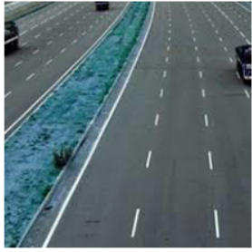
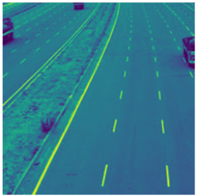
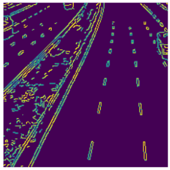
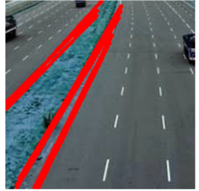

# Edge-Linking-using-Hough-Transform
## Aim:
To write a Python program to detect the lines using Hough Transform.

## Software Required:
Anaconda - Python 3.7

## Algorithm:
### Step1:
Import packages matplolib,numpy and cv2 to perform Hough transform.
<br>

### Step2:
Read the image and convert it to grayscale image.
<br>

### Step3:
Using canny detector find the edges.
<br>

### Step4:
Detect the points that form a line using Hough lines  
<br>

### Step5:
Run and execute the output.
<br>

<br></br>
<br></br>
<br></br>
<br></br>
<br></br>
<br></br>
## Program:
~~~
Program developed by: K.Balaji
Register number: 212221230011
~~~
```Python

# Read image and convert it to grayscale image
import cv2
import numpy as np
import matplotlib.pyplot as plt
input_image=cv2.imread("road.jpg")
gray=cv2.cvtColor(input_image,cv2.COLOR_BGR2GRAY)
plt.imshow(gray)
plt.axis('off')
gaus=cv2.GaussianBlur(gray,(3,3),0)
plt.imshow(gaus)
plt.axis('off')

# Find the edges in the image using canny detector and display
canny=cv2.Canny(gaus,120,150)
plt.subplot(1,1,1)
plt.imshow(canny)
plt.axis('off')

# Detect points that form a line using HoughLinesP
lines=cv2.HoughLinesP(canny,1,np.pi/180,threshold=80,minLineLength=50,maxLineGap=250)

# Draw lines on the image
for line in lines:
    x1,y1,x2,y2 = line[0]
    cv2.line(input_image,(x1,y1),(x2,y2),(255,0,0),3)


# Display the result
plt.imshow(input_image) 
plt.axis('off')


```
<br></br>
<br></br>
<br></br>
## Output

### Input image and grayscale image
### Input image

### Grayscale image

<br>

### Canny Edge detector output

<br>
<br>

### Display the result of Hough transform

<br>
<br>
<br>
<br>


## Result:
Thus the program is written with python and OpenCV to detect lines using Hough transform. 
